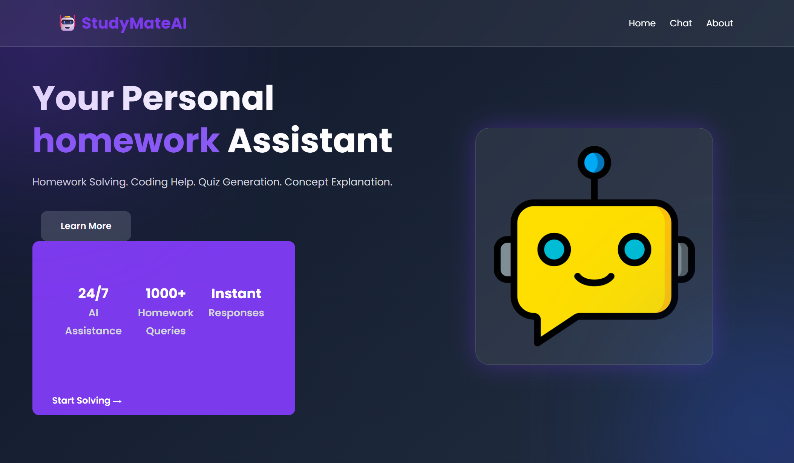
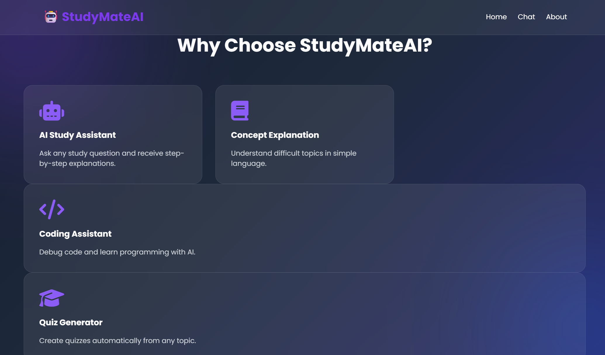
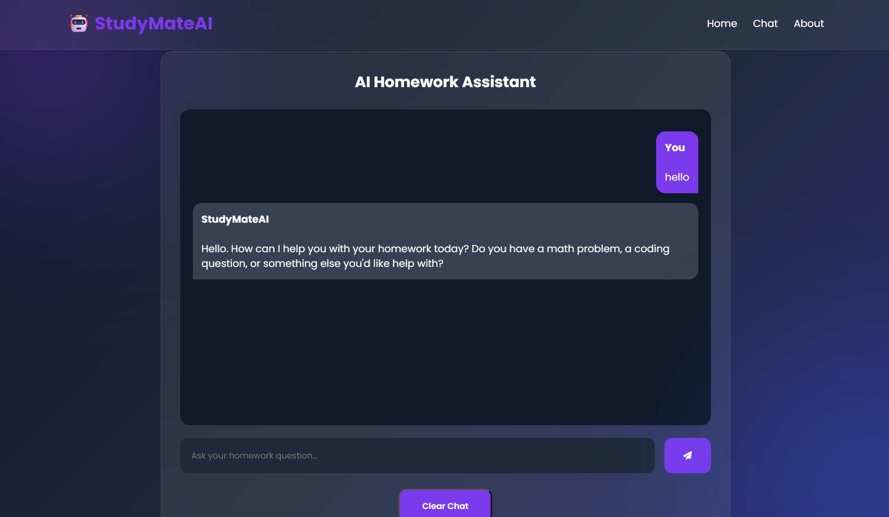
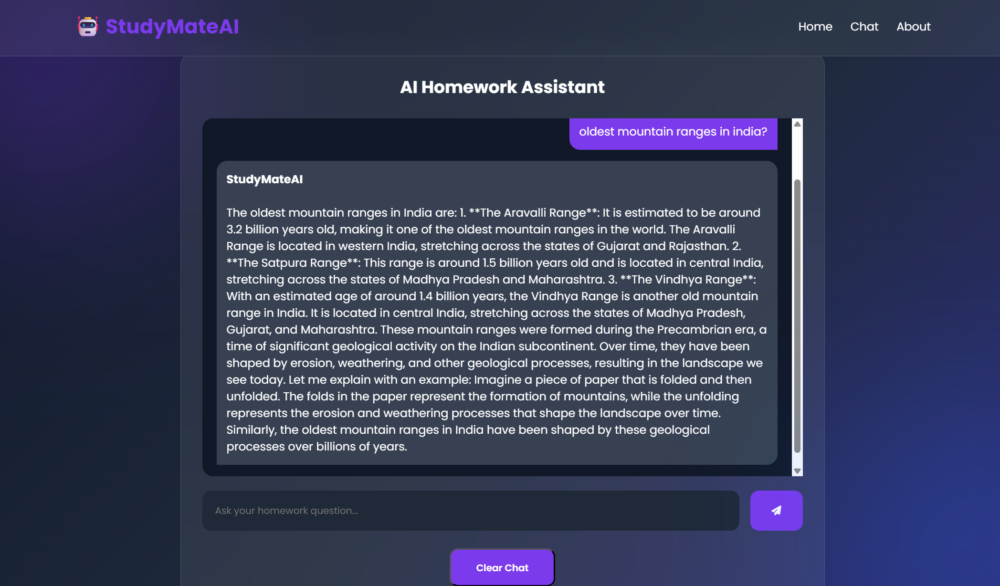

# 🎓 StudyMateAI

StudyMateAI is an AI-powered study assistant designed to help students learn more effectively. It provides instant answers to academic questions, explains concepts in simple language, assists with coding problems, and supports homework solving using AI.

---

## 🚀 Features

- 🤖 AI-powered study assistant
- 📚 Concept explanation
- 💻 Coding assistance
- 📝 Homework solving
- ⚡ Fast AI responses
- 🎨 Clean and responsive user interface

---

## 🛠️ Tech Stack

- Python
- Flask
- HTML5
- CSS3
- JavaScript
- Groq API

---

## 📂 Project Structure

```
StudyMateAI/
│── static/
│   ├── style.css
│   └── script.js
│
│── templates/
│   ├── index.html
│   ├── chat.html
│   └── about.html
│
│── app.py
│── .gitignore
│── README.md
```

---
## 📸 Screenshots

### 🏠 Home Page


### ✨ Features


### 💬 AI Chat Interface


### 🤖 AI Response


### ℹ️ About Page


## ⚙️ Installation

1. Clone the repository

```bash
git clone https://github.com/dhimangunjan07/StudyMateAI.git
```

2. Navigate to the project folder

```bash
cd StudyMateAI
```

3. Install dependencies

```bash
pip install -r requirements.txt
```

4. Create a `.env` file and add your Groq API key

```env
GROQ_API_KEY=your_api_key_here
```

5. Run the application

```bash
python app.py
```

6. Open your browser and visit:

```
http://127.0.0.1:5000
```

---

## 🎯 Future Enhancements

- Voice Assistant
- Quiz Generation
- PDF Summarization
- Image-based Question Solving
- User Authentication
- Chat History

---

## 👩‍💻 Developer

**Gunjan Dhiman**

GitHub: https://github.com/dhimangunjan07

---

## 📄 License

This project is developed for  learning purposes.
